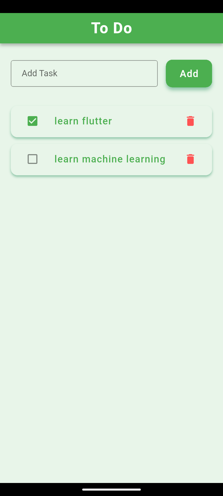

# To Do 

This is my first Flutter project! It's very basic, but this marks the beginning of my journey in Flutter development.

---

## Screenshot

---

## Features

- Add tasks
- Delete tasks
- Mark tasks as done

---

## Tech Used 

- Flutter
- Dart

---

## Note

This is just the start! I’ll keep improving my skills and making more complex apps.
# To-Do
